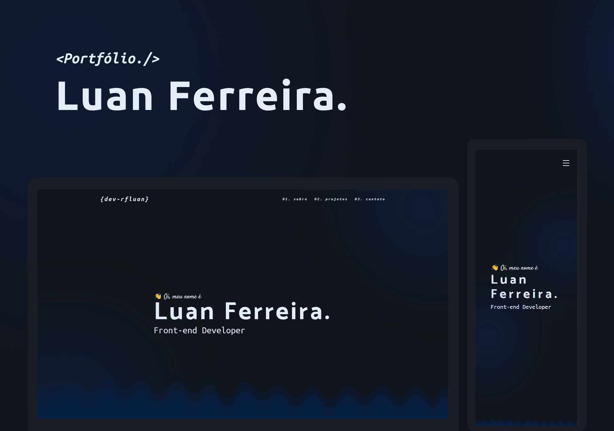

<h1 align="center"> Portfólio </h1>

  <a href="#-tecnologias">Tecnologias</a>&nbsp;&nbsp;&nbsp;|&nbsp;&nbsp;&nbsp;
  <a href="#-projeto">Projeto</a>&nbsp;&nbsp;&nbsp;|&nbsp;&nbsp;&nbsp;
  <a href="#-layout">Layout</a>&nbsp;&nbsp;&nbsp;|&nbsp;&nbsp;&nbsp;
  <a href="#memo-licença">Licença</a>

  

 

## 🚀 Tecnologias

Esse projeto foi desenvolvido com as seguintes tecnologias:

- HTML
- CSS
- JavaScript

## 💻 Projeto
 
 Projeto criado com o intuito de mostrar minhas capacidades para o mercado de front-end utilizando o básico bem feito.

## 🖥️ [Veja o site no ar](https://rfluan.github.io/portfolio/)

## :memo: Licença

Esse projeto está sob a licença MIT.

---

Feito com ♥ by Luan Ferreira :wave:
